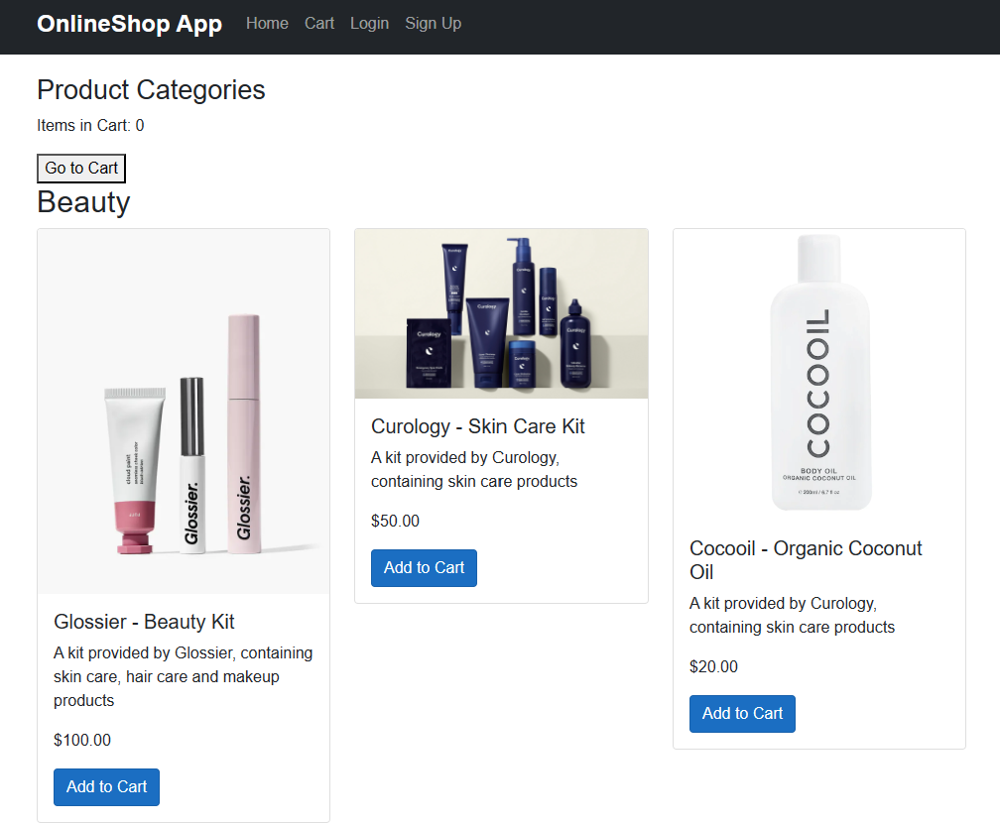
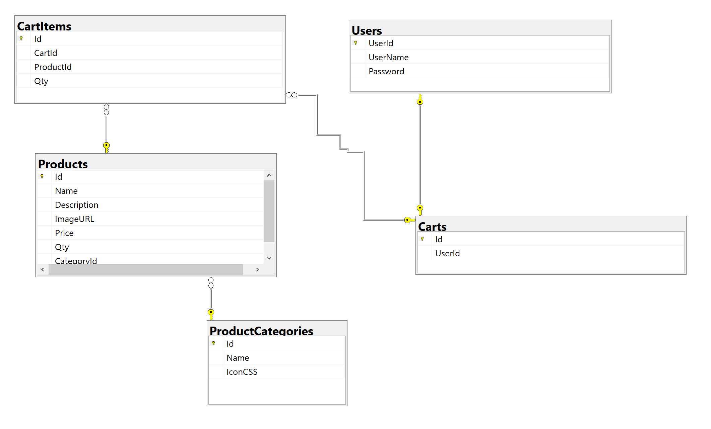

# OnlineShop App

## Contributors
Khaled Mohamed  Mtnr. 768676
Yasser Hamed  Mtnr. 762335

The OnlineShop App is a web application built using Blazor WebAssembly. It serves as an online shop platform, allowing users to browse and purchase products from various categories.

## Project Structure

The project follows the Blazor WebAssembly app template structure, which consists of three main projects:

1. **Client**: This project contains the client-side code, including the UI components, pages, and styles. It is responsible for rendering the user interface and handling user interactions.

2. **Server**: The server-side project hosts the API controllers responsible for processing HTTP requests from the client. It handles operations such as fetching product data, managing the cart, and processing payments. The server project uses Entity Framework for database operations.

3. **Shared**: The shared project contains shared models, entities, and other code that is shared between the client and server projects. It promotes code reuse and consistency across both sides of the application.

## Prerequisites

Before starting development on this project, ensure that the following prerequisites are met:

- [.NET SDK](https://dotnet.microsoft.com/download) - Make sure you have the .NET SDK installed.
- [Visual Studio](https://visualstudio.microsoft.com/) or [Visual Studio Code](https://code.visualstudio.com/) - Choose your preferred IDE for development.
- [Entity Framework Core](https://docs.microsoft.com/ef/core/) - Familiarity with Entity Framework Core is beneficial for working with the database.

## Tools used in this Project 
   - Visual studio 2022
   - SQL Server Management Studio
   - Swagger		
   - Git for Windows

## Getting Started

To get started with the OnlineShop App, follow these steps:

1. Clone the repository:

   shell
   git clone https://github.com/darmstadt-2023/group_4
   
2. Open the solution file (`OnlineShop.sln`) in your preferred IDE.

3. Set up the database:
   - Configure the connection string in the `appsettings.json` file of the server project to point to your desired database.
   - Run the Entity Framework migrations to create the database schema and seed initial data. 
   - It could be required to update the database using "dotnet ef database update" on the Package Manager Console.
	
4. Build and run the application:
   - Build the solution to restore NuGet packages and compile the projects.
   - Start the server project to run the API.
   - Launch the client project to start the Blazor WebAssembly app.

5. Access the application:
   - Open your web browser and navigate to the application's URL (usually `https://localhost:5001` or `https://localhost:5000`).

## Contributing

If you would like to contribute to the project, please follow these guidelines:

1. Fork the repository and create a new branch for your feature or bug fix.

2. Make your changes, ensuring that you adhere to the coding conventions and best practices.

3. Write tests for any new functionality or modifications to existing code.

4. Commit your changes and push them to your forked repository.

5. Submit a pull request to the main repository, describing the changes you have made.

##

## ER-Digramm

## License

This project is licensed under the [MIT License](LICENSE).
